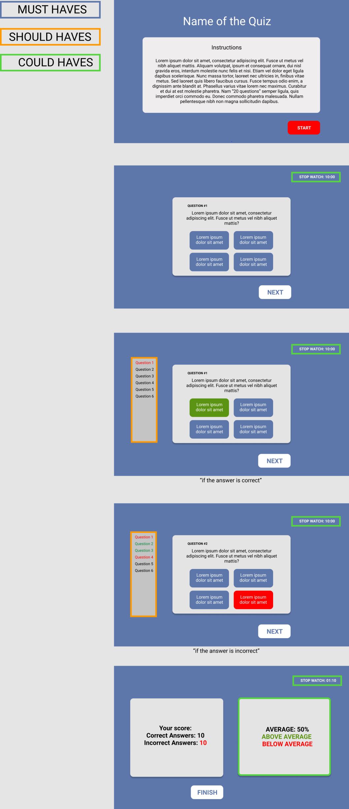

# Quiz-App Class15_4

[Live demo](https://senait-coding.github.io/architecture-starter/)

## Table of contents

  - [General info](#general-info)
  - [Wireframe](#screenshots)
  - [Technologies](#technologies)
  - [Code Example](#code-example)
  - [Members of the group](#members-of-the-group)

## General info

This group project is part of the curriculum of [HackYourFutureBe](http:/www.hackyourfuture.be) class #15, for "architecture's module" using HTML,CSS and Vanilla JavaScript.

We are going to create a Quiz-App starting from scratch based in user stories implementing software architecture showing the importance of layers for testing, collaboration, and maintenance of our code.

## Wireframe



## Technologies

- HTML 5
- CSS 3
- JavaScript
- VS code


<!-- ## Setup

- `clone the repo or fork it` -->

## Code Example

```js


```

<!-- ## Features

List of features ready and Todos for future development

-
-
-

To-do list:

-
- -->

## Members of the group

[Senait](https://github.com/Senait-coding)

[Hajir](https://github.com/Hajir-pro)

[Tatsiana](https://github.com/TatsianaRud)

[Francis](https://github.com/Osimef849)

[Michael](https://github.com/Mika215)

[Reinaldo](https://github.com/perezrei)